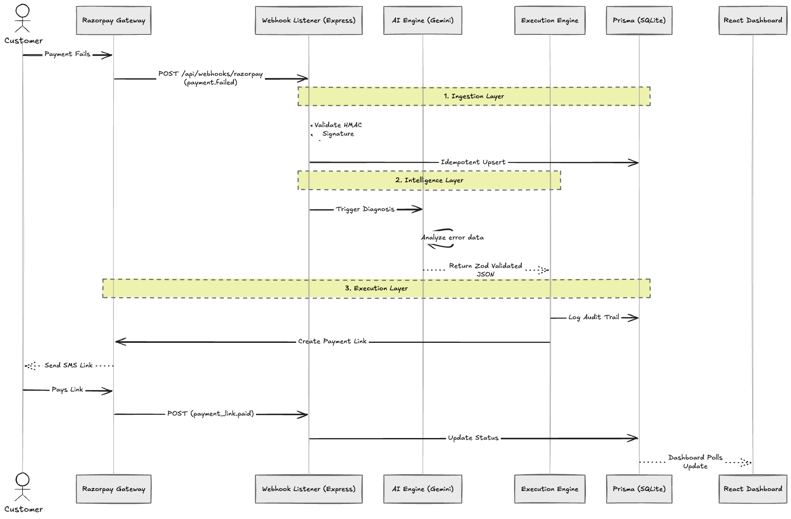

# Revvy AI (RevenueGuard)

An autonomous revenue recovery agent built to integrate with Razorpay. Revvy AI intercepts failed payments in real-time, diagnoses the root cause using an LLM intelligence layer, and programmatically executes personalized recovery strategies (such as generating and dispatching Razorpay Payment Links via SMS).

## System Architecture



The system operates on an event-driven architecture, decoupling the ingestion of gateway webhooks from the non-deterministic intelligence layer and the execution engine.

## Engineering Challenges & Solutions

Building a robust, AI-driven financial tool required solving several core engineering challenges to ensure the system is secure, fault-tolerant, and observable.

### 1. Webhook Security & Idempotency
Public webhook endpoints are inherently vulnerable to spoofing and replay attacks. Furthermore, network instability often causes gateways like Razorpay to fire duplicate events.
* **Solution:** We implemented strict HMAC-SHA256 signature validation against the raw request buffers (using `x-razorpay-signature`). To handle network retries elegantly, the ingestion layer relies on idempotent `upsert` operations in Prisma, guaranteeing our state machine processes a given failure exactly once.

### 2. Enforcing Deterministic AI Execution
Large Language Models are non-deterministic. If the intelligence layer hallucinates a recovery strategy that our execution engine does not support, the pipeline crashes.
* **Solution:** We engineered a rigid validation layer. The Gemini LLM is prompted to output a strict JSON structure, which is subsequently passed through a runtime Zod validation schema. If the LLM output violates the schema types or enumerations, the system catches the violation and safely falls back, preventing unhandled exceptions in the execution engine.

### 3. Fault Tolerance & Rate Limit Degradation
Depending on third-party LLM APIs introduces latency and strict rate limits (e.g., `429 Too Many Requests`), which is unacceptable for a time-sensitive payment recovery loop.
* **Solution:** The pipeline implements a highly resilient, two-stage fallback architecture. If the LLM throws an error or hits a rate limit, the system gracefully degrades to a deterministic, rule-based fallback engine. This engine maps Razorpay `error_reasons` directly to hardcoded recovery strategies, ensuring the execution loop never halts even during upstream AI outages.

### 4. System Observability & Trust
Autonomous agents often operate as "black boxes." If the agent incorrectly escalates a payment or spams a user, debugging the cause post-mortem is traditionally difficult.
* **Solution:** We built an append-only Immutable Audit Ledger. Every decision the agent makes triggers an audit log containing a snapshot of its reasoning and the exact Razorpay metadata it analyzed. Human operators can trace every action chronologically on the dashboard, ensuring absolute transparency and trust in the system's decisions.

## Tech Stack

* **Backend:** Node.js (Express), TypeScript, Prisma ORM (SQLite)
* **Frontend:** Next.js, React, Tailwind CSS
* **Integrations:** Razorpay SDK, Razorpay Webhooks, Google Gemini AI (3.5 Flash)

## Local Development

### Prerequisites
* Node.js (v20+)
* A Razorpay Test Account with API Keys
* A Google Gemini API Key
* ngrok (for local webhook testing)

### Setup Instructions

1. **Install dependencies and setup the database:**
   ```bash
   npm run setup
   ```

2. **Configure Environment Variables:**
   Create a `.env` file in the root directory based on `.env.example`:
   ```env
   RAZORPAY_KEY_ID=your_key_id
   RAZORPAY_KEY_SECRET=your_key_secret
   RAZORPAY_WEBHOOK_SECRET=your_webhook_secret
   GEMINI_API_KEY=your_gemini_api_key
   ```

3. **Start the Development Servers:**
   ```bash
   # Starts both the Agent backend (Port 3001) and Dashboard (Port 3000)
   npm run agent
   npm run dashboard
   ```

4. **Expose Webhooks locally:**
   ```bash
   npx ngrok http 3001
   ```
   *Add the resulting ngrok URL to your Razorpay Dashboard Webhook settings, subscribing to `payment.failed` and `payment_link.paid` events.*
